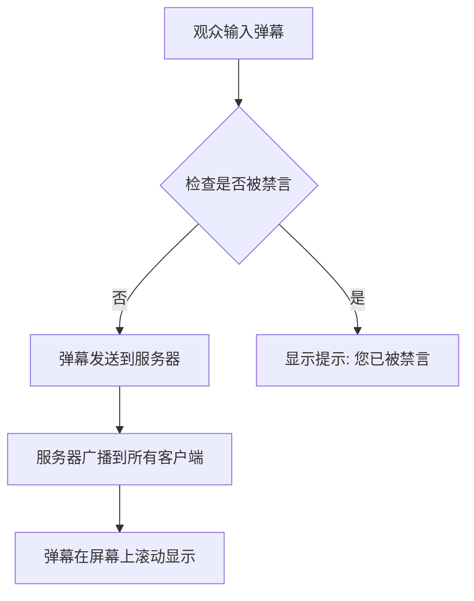
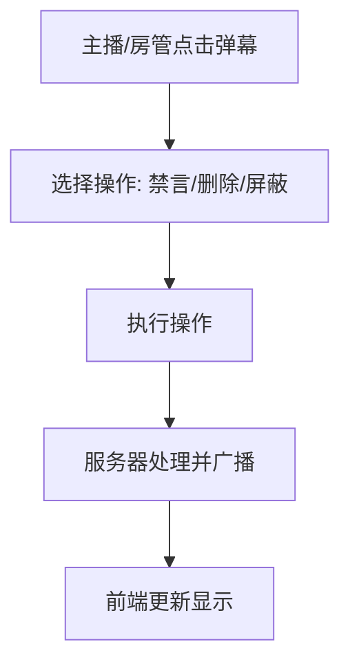

# 弹幕互动直播间 - 产品需求文档

## 1. 产品概述

一个具有弹幕控制与实时互动功能的直播间平台。主播可以实时管理弹幕（禁言、删除、屏蔽关键词），观众可以发送弹幕、送礼、点赞，与主播进行实时互动。面向娱乐主播、游戏主播等需要强互动性的内容创作者。

## 2. 核心功能

### 2.1 用户角色

| 角色 | 进入方式 | 核心权限 |
|------|----------|----------|
| 主播 | 房间创建者 | 房间管理、弹幕控制、互动设置 |
| 观众 | 通过链接/房间号进入 | 发送弹幕、送礼、点赞 |
| 房管 | 主播授权 | 禁言用户、删除弹幕 |

### 2.2 功能模块

1. **直播间页面**: 视频区域、弹幕区域、互动区域
2. **弹幕系统**: 实时弹幕显示、弹幕控制面板
3. **互动功能**: 礼物系统、点赞、观众列表
4. **主播控制台**: 房间设置、禁言管理、弹幕审核

## 3. 核心流程

### 3.1 观众发送弹幕流程

### 3.2 主播控制弹幕流程

## 4. 用户界面设计

### 4.1 设计风格

- **主题**: 暗黑赛博朋克风格，契合直播氛围
- **主色调**: 深紫 `#1a1a2e`、霓虹粉 `#ff2e63`、电光蓝 `#08d9d6`
- **按钮风格**: 霓虹发光边框，圆角带阴影
- **字体**: Orbitron (标题) + Noto Sans SC (正文)
- **布局**: 左视频右互动，侧边弹幕控制栏

### 4.2 页面设计

| 页面 | 模块 | UI元素 |
|------|------|--------|
| 直播间 | 视频区域 | 16:9 视频播放器，弹幕覆盖层 |
| 直播间 | 弹幕显示区 | 滚动弹幕从右到左，带用户名和颜色 |
| 直播间 | 互动面板 | 礼物动画、点赞飘星、观众计数 |
| 直播间 | 发送区域 | 弹幕输入框、发送按钮、表情选择 |
| 控制台 | 禁言列表 | 用户卡片、操作按钮、倒计时 |
| 控制台 | 弹幕管理 | 弹幕历史、删除/禁言快捷操作 |
| 控制台 | 房间设置 | 直播间标题、公告、背景音乐 |

### 4.3 响应式设计

- 桌面端: 左右分栏布局
- 移动端: 视频在上，互动面板可折叠

## 5. 性能指标

- 弹幕延迟 < 200ms
- 支持同时在线 1000+ 用户
- 弹幕显示流畅，无卡顿
