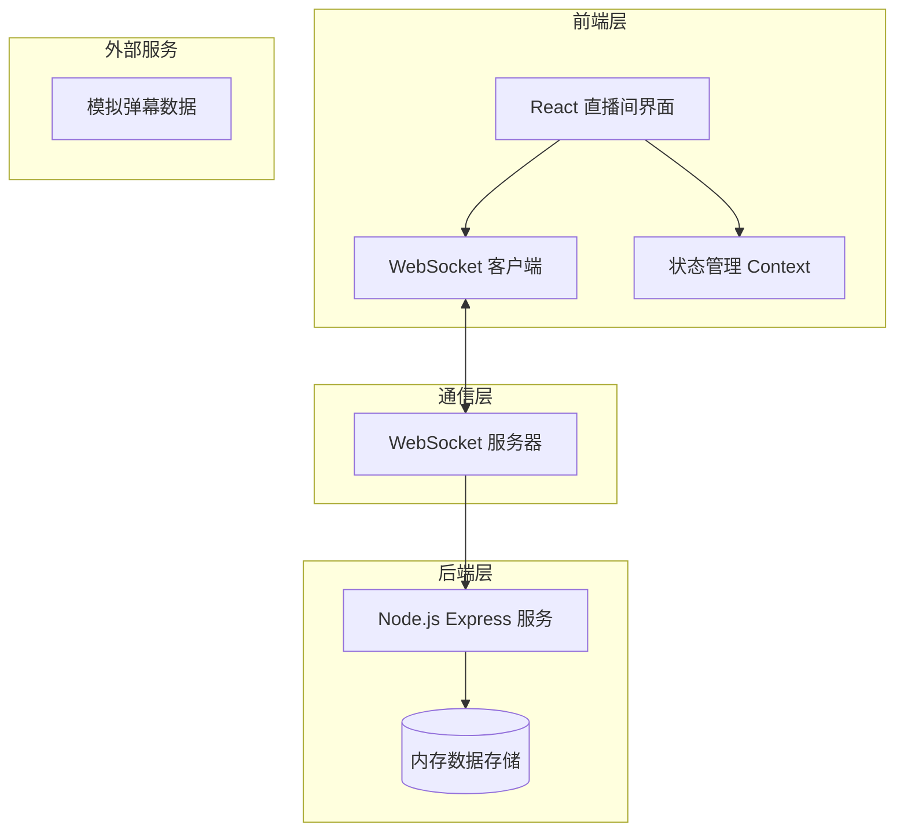
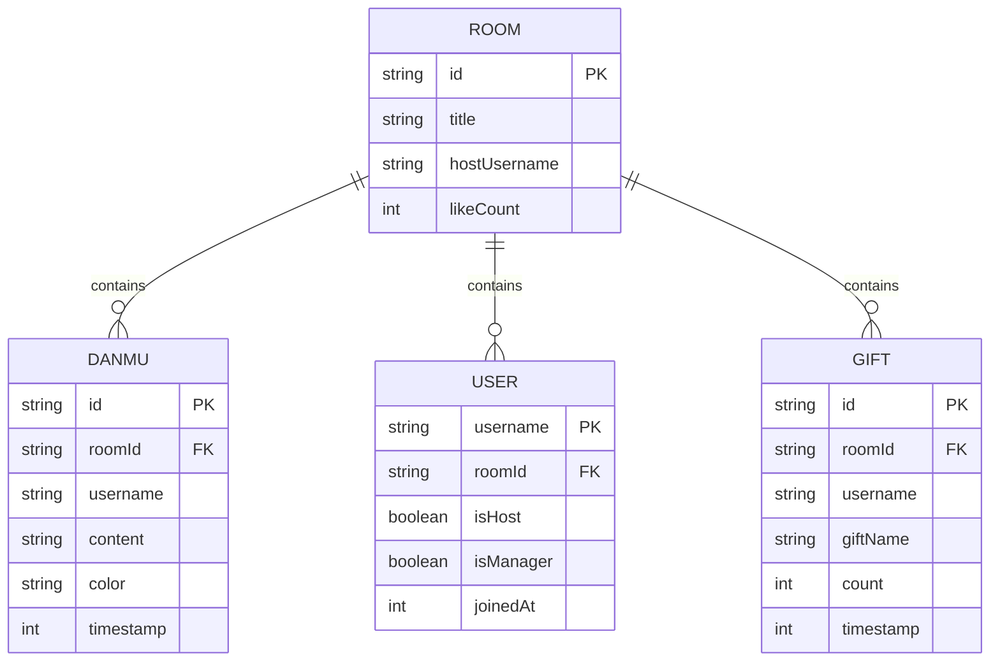

# 弹幕互动直播间 - 技术架构文档

## 1. 架构设计



## 2. 技术选型

- **前端**: React@18 + Vite + TailwindCSS@3
- **通信**: 原生 WebSocket
- **后端**: Node.js + Express@4
- **数据存储**: 内存存储 (Map/Array)
- **状态管理**: React Context

## 3. 路由定义

| 路由 | 用途 |
|------|------|
| `/` | 直播间页面 |
| `/host` | 主播控制台 |

## 4. WebSocket 协议定义

### 4.1 消息类型

```typescript
// 客户端发送给服务端
type ClientMessage =
  | { type: 'danmu'; content: string; color: string }  // 发送弹幕
  | { type: 'gift'; giftId: number; count: number }   // 送礼物
  | { type: 'like' }                                    // 点赞
  | { type: 'join'; username: string; isHost: boolean } // 加入房间

// 服务端发送给客户端
type ServerMessage =
  | { type: 'danmu'; username: string; content: string; color: string; id: string }
  | { type: 'gift'; username: string; giftName: string; count: number }
  | { type: 'like'; count: number }
  | { type: 'userList'; users: string[] }
  | { type: 'banned'; username: string }
  | { type: 'unbanned'; username: string }
  | { type: 'danmuDeleted'; danmuId: string }
  | { type: 'error'; message: string }
```

### 4.2 房间数据结构

```typescript
interface Room {
  id: string
  title: string
  hostUsername: string
  danmus: Danmu[]
  users: Map<string, User>
  bannedUsers: Map<string, number> // username -> unbanned timestamp
  likeCount: number
  giftHistory: Gift[]
}

interface Danmu {
  id: string
  username: string
  content: string
  color: string
  timestamp: number
}

interface User {
  username: string
  isHost: boolean
  isManager: boolean
  joinedAt: number
}
```

## 5. 数据模型



## 6. 核心 API

### 6.1 WebSocket 事件

| 事件名 | 方向 | 描述 |
|--------|------|------|
| `connection` | Client→Server | 建立连接 |
| `message` | 双向 | 发送消息 |
| `close` | Client→Server | 断开连接 |

### 6.2 房间初始化

```javascript
// 连接时服务端返回当前房间状态
{
  type: 'init',
  room: Room,
  users: string[]
}
```
